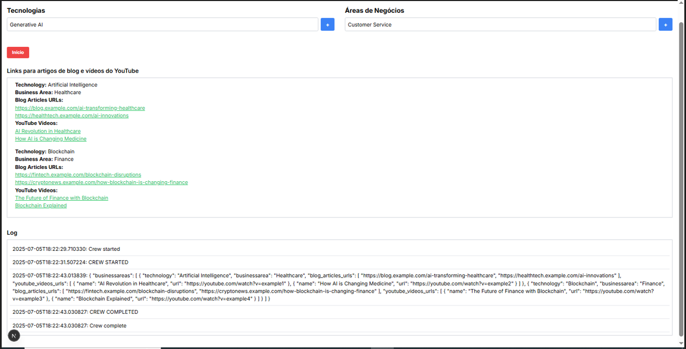

#### **APLICATIVO MULTIAGENTE - Usando Framework CrewAI**                       

**OBJETIVO :** criar um aplicativo multiagente para pesquisar como uma determinada tecnologia é usada em seu setor de trabalho ou negócio.

O aplicativo tem a função de fazer buscas automáticas no YOUTUBE e em sites de blog/articos técnicos/ciêntíficos,
etc para buscar as URLs solicitadas. 

####               EXEMPLO DE ENTRADA:  
#### TECNOLOGIAS  :  Generative AI                        
  

#### ÁREAS DE NEGÓCIOS  : Customer Service


Nos campos de entrada TECNOLOGIAS e ÁREA DE NEGÓCIOS o usuário pode informar uma ou mais tecnologias com suas respectivas
 áreas de negócios que o aplicativo Multiagent irá buscar as URLs solicitadas

 Abaixo o resultado de uma pesquisa realizada usando como entradas:
 
 TECNOLOGIAS  :  Generative AI

 ÁREAS DE NEGÓCIOS  : Customer Service               
  



### **Fluxo de Instalações e Execução do Projeto**.

---

#### ✅ 1. **Instale o Python (com pip)**

* Acesse: [https://www.python.org/downloads/windows/](https://www.python.org/downloads/windows/)
* Instale a versão 3.11 
* Durante a instalação, **marque a opção "Add Python to PATH"**.

Verifique se deu certo:

```sh
python --version
pip --version
```

---

#### ✅ 2. **Instale o Node.js (inclui o npm)**

* Acesse: [https://nodejs.org/](https://nodejs.org/)
* Baixe a versão LTS recomendada.

Verifique se está ok:

```sh
node -v
npm -v
```

---

#### ✅ 3. **Instale o Git (caso ainda não tenha)**

* Acesse: [https://git-scm.com/download/win](https://git-scm.com/download/win)
* Durante a instalação, aceite as configurações padrão.

Verifique:

```sh
git --version
```

---

#### ✅ 4. **Clone o projeto do GitHub**

No terminal ou Git Bash:

```sh
git clone https://github.com/seu-usuario/seu-repositorio.git
cd seu-repositorio
```

---

#### ✅ 5. **Configure o backend (Python)**

Esse projeto usa arquivos `requirements.txt` e `pyproject.toml`.

#### 📌 Com `requirements.txt`:

No Diretório raiz do projeto, crie um ambiente virtual em python 3.11.4, ative o ambiente virtual
e instale os pacotes python como abaixo:
  
```sh
python -m venv venv
venv\Scripts\activate
pip install -r requirements.txt
```

#### 📌 Com `Poetry` :

Agora Instale o Poetry :

```sh
pip install poetry
```

Depois do ambiente virtual ativado:
Acesse o diretório backend e use "poetry install --no-root" para garantir a instalação dos mesmos pacotes que usamos:  
    
```sh
cd backend
poetry install --no-root
```

**NOTA IMPORTANTE:**
Para este projeto você vai precisar obter algumas API KEY para execução deste aplicativo, bem como criar um arquivo .env:

o arquivo .env ficará como abaixo:

    
```sh
OPENAI_API_KEY="sua openai api key"

YOUTUBE_API_KEY="sua youtube api key"

SERPER_API_KEY="sua serper api key"

LANGCHAIN_TRACING_V2=true
LANGCHAIN_ENDPOINT=https://api.smith.langchain.com
LANGCHAIN_PROJECT=multiagents
```

**Aqui os links para a obtenção das API KEY:**

1-Passos para criar sua OPENAI_API_KEY

  https://platform.openai.com/settings/organization/api-keys

2-Passos para criar sua YOUTUBE_API_KEY

  https://console.cloud.google.com/

  No topo da página, clique no seletor de projetos.
  - Clique em "Novo Projeto".
  - Dê um nome e clique em "Criar".
  - Ative a YouTube Data API v3:
    - Com o projeto selecionado, acesse:
    -  https://console.cloud.google.com/apis/library/youtube.googleapis.com
    - Clique em “Ativar”.
    - Crie uma chave de API
    - Vá para: 
     https://console.cloud.google.com/apis/credentials
    - Clique em “Criar credenciais” > “Chave de API”
    - A chave será gerada e exibida. 
    - Copie-a — essa é a sua YOUTUBE_API_KEY.  


3-Passos para criar sua SERPER_API_KEY

https://serper.dev/api-keys


---

#### ✅ 6. Configure o frontend 

Com o ambiente virtual ativado , entre na pasta do frontend como abaixo :

```sh
cd frontend
npm ci
```

---

#### ✅ 7. Instale os pacotes "axios" e  "react-hot-toast" 

Com o ambiente virtual ativado, vá para o  diretório raiz do projeto instale os seguintes pacote como abaixo:

```sh
npm install axios
npm install react-hot-toast
```

---  


#### ✅ 8. Execute o backend 

Com o ambiente virtual ativado, vá para a pasta backend e rode a api.py como abaixo:

```sh
cd backend
python api.py
```

---

#### ✅ 9. Execute o frontend 

Com o ambiente virtual ativado, vá para a pasta frontend e rode como abaixo:

```sh
cd frontend
npm run dev
```

---

#### ✅ 10. Acesse no navegador

Acesse o seu navegador e cole a url abaixo :

 [http://localhost:3000](http://localhost:3000)  

---

## ✅ Resumo das Instalações:

| Software      | Usado para                    | Necessário?                          |
| ------------- | ----------------------------- | ------------------------------------ |
| Python        | Backend em Python             | ✅ Sim                               |
| Pip/Poetry    | Gerenciar dependências Python | ✅ Sim                               |
| Node.js + npm | Frontend em React/Next.js     | ✅ Sim                               |
| Git           | Clonar o repositório          | ✅ Sim                               |
| React/Next.js | Framework frontend JS         | ⚠️ Não precisa instalar globalmente  |

---

   